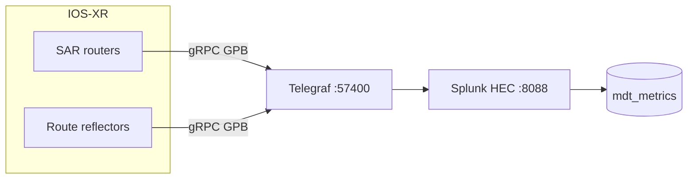

# Stream IOS-XR Interface Telemetry to Splunk

Guide for the **scale-across** containerlab: eight SAR routers plus two XRD route
reflectors. Telemetry lands in Splunk **`mdt_metrics`**; the Network Graph will use
**OpenConfig octet rates** for a click → traffic panel (next step).

---

## Architecture

IOS-XR does **not** POST to Splunk HEC directly. Use **Telegraf** as a gRPC collector
and forward via HEC (`splunkmetric` format).



References: [cisco-splunk-mdt](https://github.com/ciscops/cisco-splunk-mdt),
[Splunk Lantern gRPC guide](https://lantern.splunk.com/Platform_Data_Management/Unlock_Insights/Monitoring_Cisco_network_devices_using_gRPC).

Lab config in repo: `config/telegraf/telegraf.conf`, `config/dc00-p00-sar00.cfg`
(telemetry block replicated on other SARs).

| Component | Lab value |
|-----------|-----------|
| Telegraf listen | `198.18.201.39:57400` |
| Splunk HEC | `https://198.18.201.42:8088/services/collector` |
| Metrics index | `mdt_metrics` |
| MDT sample interval | 30s (`sample-interval 30000`) |
| SAR mgmt IPs | `198.18.204.32`–`.39` |

---

## Step 1 — Splunk indexes and HEC

1. **Settings → Indexes → New Index** — name `mdt_metrics`, type **Metrics**.
2. **Settings → Data inputs → HTTP Event Collector → New Token**
   - Name: `mdt_hec_metrics`
   - Allowed index: `mdt_metrics`
3. **HEC Global Settings** — enabled; note whether you use HTTPS on `:8088`.

HEC auth header must be `Authorization: Splunk <token>` (not the raw UUID).

Quick test:

```bash
curl -k "https://198.18.201.42:8088/services/collector" \
  -H "Authorization: Splunk YOUR_METRICS_HEC_TOKEN" \
  -H "Content-Type: application/json" \
  -d '{"event": "hec_test", "sourcetype": "manual"}'
```

Expect HTTP 200 / `"Success"`.

---

## Step 2 — Telegraf

Install [Telegraf](https://www.influxdata.com/get-telegraf/) on the collector host.
Use the repo file `config/telegraf/telegraf.conf` (replace HEC token via env/secrets,
not git).

Key settings:

- `service_address = ":57400"` — must match router `destination-group` port
- `data_format = "splunkmetric"` + `splunkmetric_hec_routing = true`
- `Authorization = "Splunk …"` in `[outputs.http.headers]`

Debug (optional): uncomment `[[outputs.file]]` → `/tmp/telegraf-mdt.json`.

```bash
sudo systemctl restart telegraf
ss -lntp | grep 57400
```

---

## Step 3 — IOS-XR MDT (SAR routers)

Example from `config/dc00-p00-sar00.cfg`:

```iosxr
telemetry model-driven
 destination-group DGroup1
  vrf Mgmt-intf
  address-family ipv4 198.18.201.39 port 57400
   encoding self-describing-gpb
   protocol grpc no-tls
  !
 !
 sensor-group interfaces
  sensor-path Cisco-IOS-XR-pfi-im-cmd-oper:interfaces/interface-summary
  sensor-path Cisco-IOS-XR-infra-statsd-oper:infra-statistics/interfaces/interface/data-rate
  sensor-path Cisco-IOS-XR-infra-statsd-oper:infra-statistics/interfaces/interface/latest/generic-counters
 !
 subscription interfaces
  sensor-group-id interfaces strict-timer
  sensor-group-id interfaces sample-interval 30000
  destination-id DGroup1
  source-interface MgmtEth0/RP0/CPU0/0
 !
!
```

Verify on box:

```iosxr
show telemetry model-driven subscription interfaces
show grpc status
```

---

## Step 4 — Splunk queries that work

`mdt_metrics` is a **metrics** index — use `| mstats`, `| mcatalog`, or `| mpreview`.
Plain `index=mdt_metrics | head` usually returns nothing.

### Confirm data is arriving

```spl
| mstats count(*) WHERE index=mdt_metrics span=1h
```

### Metric names and dimensions

```spl
| mcatalog values(_dims) WHERE index=mdt_metrics GROUPBY metric_name
| rename values(_dims) AS dimensions
| table metric_name dimensions
```

**Use OpenConfig counters for link traffic** (dimension **`name`**). Splunk stores
the router hostname in **`source`** (from the MDT dial-out tag), not as a post-mstats
search field.

List interfaces per router:

```spl
| mstats latest(_value) AS val
  WHERE index=mdt_metrics
    metric_name="openconfig-interfaces:interfaces/interface.state/counters/out_octets"
  BY name, source
| where name=*EightHundred*
| sort source, name
```

### Link traffic time-series (panel SPL)

Tokens: `$router$` (e.g. `dc00-p00-sar00`), `$ifname$` (e.g. `EightHundredGigE0/0/0/0`).

**Outbound Mbps** (verified working):

```spl
| mstats rate(_value) AS octets_per_sec
  WHERE index=mdt_metrics
    metric_name="openconfig-interfaces:interfaces/interface.state/counters/out_octets"
    name="$ifname$"
    source="$router$"
  span=30s
| eval mbps=round(octets_per_sec * 8 / 1000000, 3)
| timechart span=30s avg(mbps) AS "Outbound Mbps"
```

**Example**
```spl
| mstats rate(_value) AS octets_per_sec
  WHERE index=mdt_metrics
    metric_name="openconfig-interfaces:interfaces/interface.state/counters/out_octets"
    name="EightHundredGigE0/0/0/0"
    source="dc00-p00-sar00"
  span=120s
| eval mbps=round(octets_per_sec * 8 / 1000000, 3)
| timechart span=30s avg(mbps) AS "Outbound Mbps"
```

**Example**
```spl
| mstats latest(_value) AS val
  WHERE index=mdt_metrics
    metric_name="openconfig-interfaces:interfaces/interface.state/counters/out_octets"
  BY name, source
| sort source, name
```

Use `span=30s` to match the 30s MDT interval (fewer empty chart buckets than `1m`).

**Inbound + outbound:**

```spl
| mstats rate(_value) AS val
  WHERE index=mdt_metrics
    (metric_name="openconfig-interfaces:interfaces/interface.state/counters/out_octets"
     OR metric_name="openconfig-interfaces:interfaces/interface.state/counters/in_octets")
    name="$ifname$"
    source="$router$"
  span=30s
| eval mbps=round(val * 8 / 1000000, 3)
| eval direction=if(match(metric_name, "out_octets"), "out", "in")
| timechart span=30s avg(mbps) BY direction
```

Idle lab links often show ~0.001 Mbps (control traffic). Run traffic tests to see
spikes.

### SPL rules (learned the hard way)

| Do | Don't |
|----|--------|
| `metric_name="openconfig-interfaces:…"` in `WHERE` | Bare `bytes_sent` or unquoted `ifstats.bytes_sent` |
| `source="$router$"` inside mstats `WHERE` | `\| search source=…` after `mstats` |
| `name="$ifname$"` for OpenConfig | `interface_name=` (statsd dimension; not used for OC) |
| `\| mstats` / `\| mcatalog` | `index=mdt_metrics` alone |

---

## Step 5 — Graph click → traffic panel

Each topology link row now includes **`linkRouter`** and **`linkIfname`** (parsed from
IOS-XR interface descriptions in `config/*.cfg`). Regenerate with:

```bash
python3 scripts/topo_to_spl.py --topo topology.clab.yaml \
  -o scripts/topology_network_graph.spl \
  --patch-dashboard scripts/topology_network_graph.dashboard.json
```

**Dashboard wiring** (`topology_network_graph.dashboard.json`):

- Network Graph uses **two data sources** (Splunk best practice): `ds_topology_links` (edges only) + `ds_topology_nodes` (node styling). Link clicks set `$router$`, `$ifname$`, `$link_role$` via Set tokens on the graph.
- Line chart below the graph plots outbound OpenConfig Mbps for the clicked link.

**Click a link** on the graph (not a node). Node clicks do not carry interface metadata.

Example mapping (fabric):

```
source=dc00-p00-sar00  target=dc01-p00-sar00  linkRole=plane0-link0
linkRouter=dc00-p00-sar00  linkIfname=EightHundredGigE0/0/0/0
```

Interface descriptions in router config:

```iosxr
interface EightHundredGigE0/0/0/0
 description to dc01-p00-sar00 link0
```

Host links use `dc00-host00-l0` / `dc1-host00-l1` style descriptions on the SAR side.

---

## Troubleshooting

| Symptom | Fix |
|---------|-----|
| Splunk 0 results, Telegraf OK | HEC header needs `Splunk ` prefix; index type must be **Metrics** |
| Plain `index=mdt_metrics` empty | Use `\| mstats count(*) WHERE index=mdt_metrics` |
| Query works without router, fails with router | Put `source="hostname"` in mstats **WHERE**, not `\| search` after |
| Sparse timechart buckets | Match `span=30s` to MDT sample interval |
| No data in Telegraf | `show telemetry model-driven subscription interfaces` — **Active**? |
| HEC errors | `journalctl -u telegraf -f \| grep -iE 'http\|401\|403'` |

---

## Security (production)

- TLS on gRPC and HTTPS to Splunk
- Do not commit HEC tokens (use secrets / env)
- Restrict mgmt ACLs to Telegraf → router gRPC

---

## Related commands

```bash
# Topology dashboard (separate from telemetry)
python3 scripts/topo_to_spl.py --topo topology.clab.yaml \
  -o scripts/topology_network_graph.spl \
  --patch-dashboard scripts/topology_network_graph.dashboard.json

python3 scripts/topo_to_spl.py --topo topology.clab.yaml \
  --demo-dashboard scripts/topology_network_graph.demo.json
```

---

## Next steps

1. ~~Telemetry → Splunk~~ **done**
2. ~~OpenConfig Mbps panel SPL~~ **done**
3. ~~Lookup `linkRole` → `(router, ifname)`~~ **done** (`linkRouter`, `linkIfname` in SPL)
4. ~~Wire Network Graph Set tokens + timechart panel~~ **done** (re-import patched dashboard JSON)

See also: `scripts/NETWORK_GRAPH.md`, `scripts/topo_to_spl.py`.
